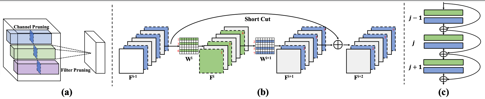
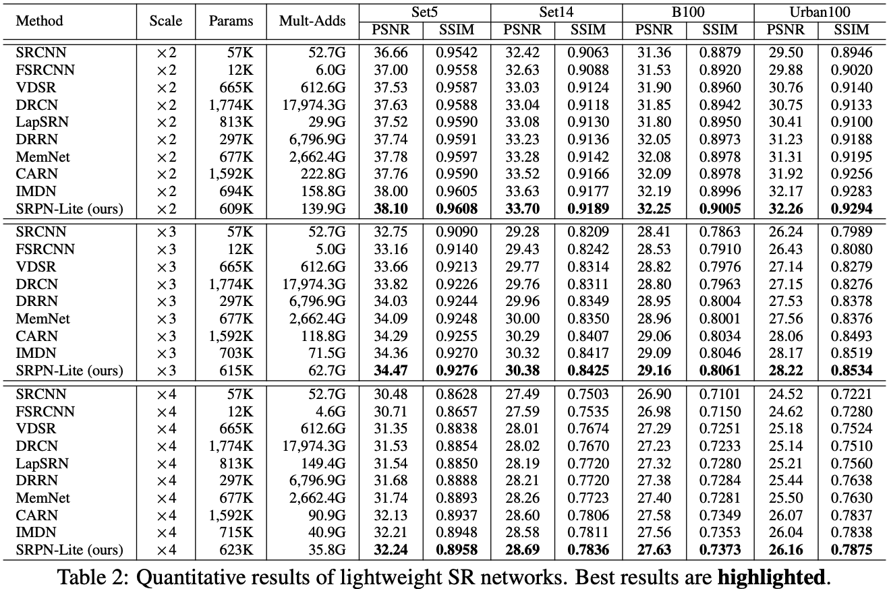
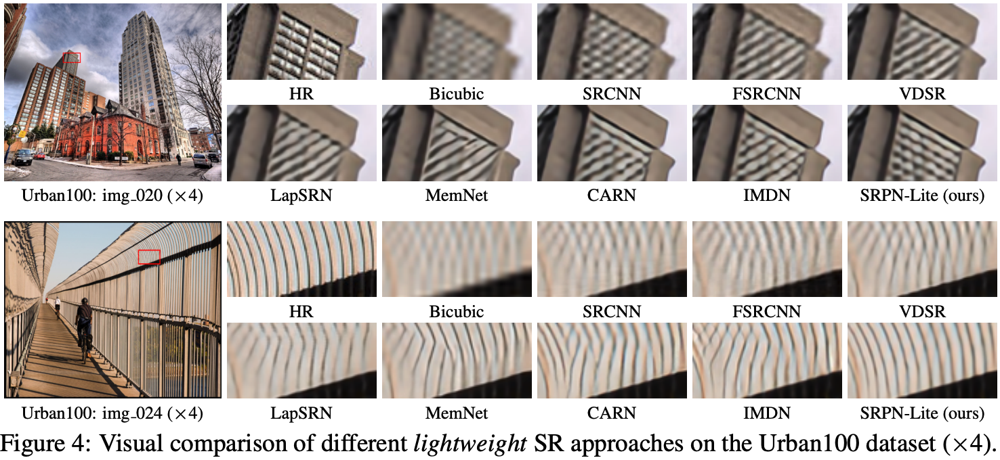
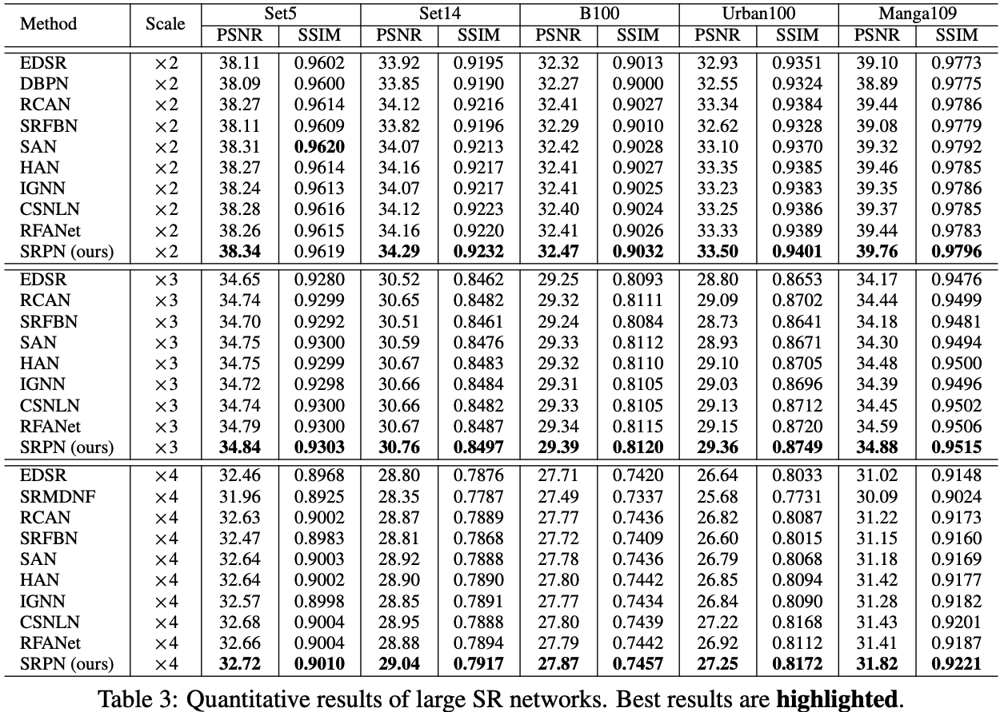
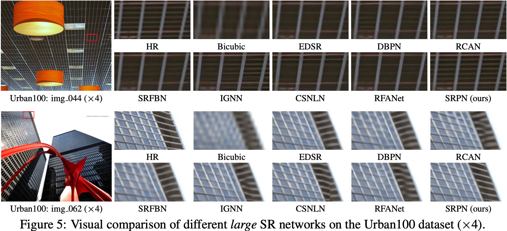

# SRP (Structure-Regularized Pruning) ICLR'22

<div align="center">
    <a></a>
    &nbsp &nbsp
    <a></a>
</div>

This repository is for a new network pruning method (`Structure-Regularized Pruning, SRP`) for efficient single image super-resolution (SR), introduced in our ICLR 2022 poster paper:
> **[Learning Efficient Image Super-Resolution Networks via Structure-Regularized Pruning](https://openreview.net/pdf?id=AjGC97Aofee)** \
> [Yulun Zhang*](http://yulunzhang.com/), [Huan Wang*](http://huanwang.tech/), [Can Qin](http://canqin.tech/), [Yun Fu](http://www1.ece.neu.edu/~yunfu/) (*equal contribution) \
> Northeastern University, Boston, MA, USA

## Introduction
<div align="center">
  
</div>

<p align="justify">
Several image super-resolution (SR) networks have been proposed of late for efficient SR, achieving promising results. However, they are still not lightweight enough and neglect to be extended to larger networks. At the same time, model compression techniques, like neural architecture search and knowledge distillation, typically consume considerable computation resources. In contrast, network pruning is a cheap and effective model compression technique. However, it is hard to be applied to SR networks directly because filter pruning for residual blocks is well-known tricky. To address the above issues, we propose structure-regularized pruning (SRP), which imposes regularization on the pruned structure to ensure the locations of pruned filters are aligned across different layers. Specifically, for the layers connected by the same residual, we select the filters of the same indices as unimportant filters. To transfer the expressive power in the unimportant filters to the rest of the network, we employ L2 regularization to drive the weights towards zero so that eventually, their absence will cause minimal performance degradation. We apply SRP to train efficient image SR networks, resulting in a lightweight network SRPN-Lite and a very deep one SRPN. We conduct extensive comparisons with both lightweight and larger networks. SRPN-Lite and SRPN perform favorably against other recent efficient SR approaches quantitatively and visually.
</p>

## Install
```python
git clone git@github.com:mingsun-tse/SRP.git -b master
cd SRP/src

# We used PyTorch 1.2.0; higher versions should also be okay. Anaconda is strongly recommended
pip install -r requirements.txt
```

## Train
### Prepare training data 

1. Download DIV2K training data (800 training + 100 validtion images) from [DIV2K dataset](https://data.vision.ee.ethz.ch/cvl/DIV2K/) or [SNU_CVLab](https://cv.snu.ac.kr/research/EDSR/DIV2K.tar) and [Flickr2K dataset](https://cv.snu.ac.kr/research/EDSR/Flickr2K.tar) from SNU_CVLab.

2. Specify '--dir_data' based on the HR and LR images path. In option.py, '--ext' is set as 'sep_reset', which first convert .png to .npy. If all the training images (.png) are converted to .npy files, then set '--ext sep' to skip converting files.

For more informaiton, please refer to [EDSR(PyTorch)](https://github.com/thstkdgus35/EDSR-PyTorch).


### Prepare pretrained dense model
Neural network pruning is typically conducted on a *pretrained* model. Our method also follows this common practice. Before we run the pruning scripts next, here we set up the pretrained dense models. Download the `pretrain_model.zip` from our [releases](https://github.com/MingSun-Tse/SRP/releases), and unzip it as follows:
```python
wget https://github.com/MingSun-Tse/SRP/releases/download/v0.1/pretrain_model.zip
unzip pretrain_model.zip
mv pretrain_model ..
```

### Run
```python
# Efficient SR models, with Large EDSR (Tab. 2)
python main.py --model LEDSR --scale 2 --patch_size 96 --ext sep --dir_data data/SR/RGB/BIX2X3X4/pt_bin --data_train DF2K --data_test DF2K --data_range 1-3550/3551-3555 --chop --save_results --n_resblocks 16 --n_feats 256 --method SRP --index_layer name_matching --stage_pr *:0.82421875 --skip_layers *mean*,*tail* --same_pruned_wg_layers model.head.0,model.body.16,*body.2 --reg_upper_limit 0.5 --reg_granularity_prune 0.0001 --update_reg_interval 20 --stabilize_reg_interval 43150 --pre_train ../pretrain_model/LEDSR_F256R16BIX2_DF2K_M311.pt --project SRP__LEDSR__X2__UsePretrained_Channels45

python main.py --model LEDSR --scale 3 --patch_size 144 --ext sep --dir_data data/SR/RGB/BIX2X3X4/pt_bin --data_train DF2K --data_test DF2K --data_range 1-3550/3551-3555 --chop --save_results --n_resblocks 16 --n_feats 256 --method SRP --index_layer name_matching --stage_pr *:0.82421875 --skip_layers *mean*,*tail* --same_pruned_wg_layers model.head.0,model.body.16,*body.2 --reg_upper_limit 0.5 --reg_granularity_prune 0.0001 --update_reg_interval 20 --stabilize_reg_interval 43150 --pre_train ../pretrain_model/LEDSR_F256R16BIX3_DF2K_M230.pt --project SRP__LEDSR__X3__UsePretrained_Channels45

python main.py --model LEDSR --scale 4 --patch_size 192 --ext sep --dir_data data/SR/RGB/BIX2X3X4/pt_bin --data_train DF2K --data_test DF2K --data_range 1-3550/3551-3555 --chop --save_results --n_resblocks 16 --n_feats 256 --method SRP --index_layer name_matching --stage_pr *:0.82421875 --skip_layers *mean*,*tail* --same_pruned_wg_layers model.head.0,model.body.16,*body.2 --reg_upper_limit 0.5 --reg_granularity_prune 0.0001 --update_reg_interval 20 --stabilize_reg_interval 43150 --pre_train ../pretrain_model/LEDSR_F256R16BIX4_DF2K_M231.pt --project SRP__LEDSR__X4__UsePretrained_Channels45


# Large SR models, with modified RCAN (channel attention removed) (Tab. 3)
python main.py --model RIRSR --scale 2 --patch_size 96 --chop --save_results --n_resgroups 10 --n_resblocks 20 --n_feats 96 --method SRP --index_layer name_matching --stage_pr *:0.34 --skip_layers *mean*,*tail* --same_pruned_wg_layers model.head.0,model.body.10,*body.2,*body.20 --reg_upper_limit 0.5 --reg_granularity_prune 0.0001 --update_reg_interval 20 --stabilize_reg_interval 43150 --pre_train ../pretrain_model/RIRSR_BIX2_G10R20F96P48M793.pt  --project SRP__RIRSR__X2__UsePretrained_PR0.34

python main.py --model RIRSR --scale 3 --patch_size 144 --chop --save_results --n_resgroups 10 --n_resblocks 20 --n_feats 96 --method SRP --index_layer name_matching --stage_pr *:0.34 --skip_layers *mean*,*tail* --same_pruned_wg_layers model.head.0,model.body.10,*body.2,*body.20 --reg_upper_limit 0.5 --reg_granularity_prune 0.0001 --update_reg_interval 20 --stabilize_reg_interval 43150 --pre_train ../pretrain_model/RIRSR_BIX3_G10R20F96P48M589.pt  --project SRP__RIRSR__X3__UsePretrained_PR0.34

python main.py --model RIRSR --scale 4 --patch_size 196 --chop --save_results --n_resgroups 10 --n_resblocks 20 --n_feats 96 --method SRP --index_layer name_matching --stage_pr *:0.34 --skip_layers *mean*,*tail* --same_pruned_wg_layers model.head.0,model.body.10,*body.2,*body.20 --reg_upper_limit 0.5 --reg_granularity_prune 0.0001 --update_reg_interval 20 --stabilize_reg_interval 43150 --pre_train ../pretrain_model/RIRSR_BIX4_G10R20F96P48M88.pt  --project SRP__RIRSR__X4__UsePretrained_PR0.34

```
Note, the data should be set up at the path `--dir_data data/SR/RGB/BIX2X3X4/pt_bin`.


## Results
### 1.1 Quantitative Results with Efficient SR Models
PSNR/SSIM comparison on popular SR benchmark datasets is shown below (best in red, second best in blue).
<div align="center">
  
</div>

### 1.2 Visual Results with Efficient SR Models
Visual comparison (x4) among lightweight SR approaches on the Urban100 dataset is shown below. Please see our [releases](https://github.com/MingSun-Tse/ASSL/releases) for the complete visual results on Set5/Set14/B100/Urban100/Manga109.
<div align="center">
  
</div>

### 2.1 Quantitative Results with Large SR Models
PSNR/SSIM comparison on popular SR benchmark datasets is shown below (best in red, second best in blue).
<div align="center">
  
</div>

### 2.2 Visual Results with Large SR Models
Visual comparison (x4) among lightweight SR approaches on the Urban100 dataset is shown below. Please see our [releases](https://github.com/MingSun-Tse/ASSL/releases) for the complete visual results on Set5/Set14/B100/Urban100/Manga109.
<div align="center">
  
</div>


## Citation
If you find the code helpful in your resarch or work, please cite the following papers.
```
@inproceedings{zhang2022learning,
    title={Learning Efficient Image Super-Resolution Networks via Structure-Regularized Pruning},
    author={Zhang, Yulun and Wang, Huan and Qin, Can and Fu, Yun},
    booktitle={ICLR},
    year={2022}
}
```

## Acknowledgements
We refer to the following implementations when we develop this code: [ASSL](https://github.com/MingSun-Tse/ASSL), [EDSR-PyTorch](https://github.com/thstkdgus35/EDSR-PyTorch), [RCAN](https://github.com/yulunzhang/RCAN), [Regularization-Pruning](https://github.com/MingSun-Tse/Regularization-Pruning). Great thanks to them!
